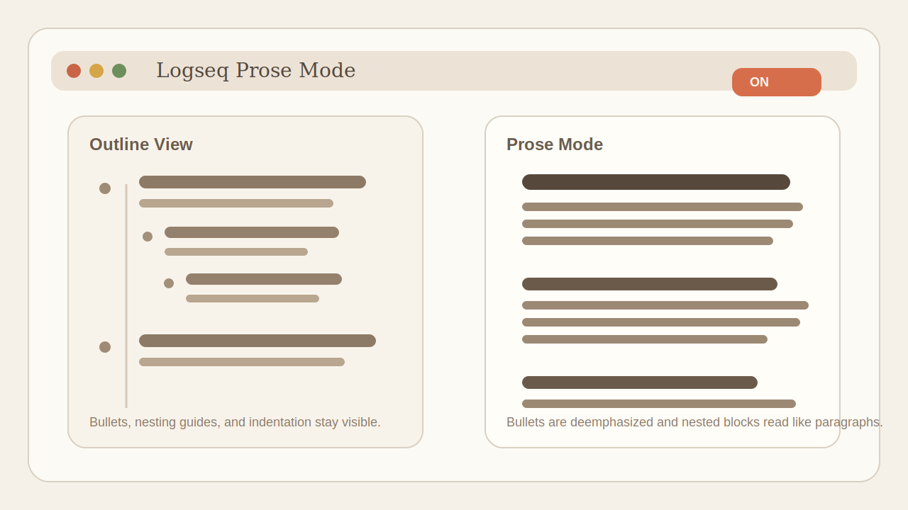

# logseq-prose-mode

Focused document-style writing mode for Logseq.

Plugin ID: `logseq-prose-mode`

## Author

- FelixHuoEZ
- Codex

## Preview



Concept illustration of the writing-focused layout with bullets and indentation visually reduced.

## Features

- Toggle prose mode from the toolbar or command palette
- Hide normal block bullets while keeping them available on hover
- Flatten nested indentation to reduce the outliner feel
- Remove thread lines and tighten page layout for writing
- Optional support for applying the mode to the right sidebar too

## Settings

- `Shortcut`: keyboard shortcut for toggling prose mode
- `Enabled by default`: enable the mode on startup
- `Apply to right sidebar`: include right sidebar content in the styling scope
- `Hide bullets`: hide normal bullets in prose mode
- `Show bullets on hover`: temporarily reveal hidden bullets on hover
- `Flatten indentation`: remove most nested indentation
- `Keep typed list bullets`: keep visible bullets/numbers for typed lists
- `Content left padding`: page padding in prose mode
- `Content right padding`: page padding in prose mode

## Install

### From Marketplace

Search for `Prose Mode` in the Logseq plugin marketplace after the plugin is approved.

### From GitHub Release

1. Open the latest release on GitHub.
2. Download `logseq-prose-mode.zip`.
3. Unzip it into a local folder.
4. In Logseq, use `Plugins` -> `Load unpacked plugin` and select that folder.

### From Source

This repository is the source code repository. It does not commit `dist/` on `main`.

If you want to run the plugin from source:

1. Clone this repository.
2. Run `npm install`.
3. Run `npm run build`.
4. In Logseq, use `Plugins` -> `Load unpacked plugin` and select this folder.

## Development

```bash
npm install
npm run build
```

Then load the plugin in Logseq from this folder.

## Release Strategy

- `main` stores source files and release automation, not committed `dist/` artifacts
- GitHub Releases are the installation channel for packaged builds
- `npm run release:zip` builds `dist/` and creates `logseq-prose-mode.zip`
- The release zip contains the files Logseq needs at runtime: `dist/`, `package.json`, `README.md`, `LICENSE`, and `icon.png`

## Maintainer Release Flow

```bash
npm install
npm run release:zip
git tag v0.1.1
git push origin main --tags
```

Pushing a version tag triggers the publish workflow and uploads the release zip automatically.

## License

MIT. See [LICENSE](./LICENSE).
